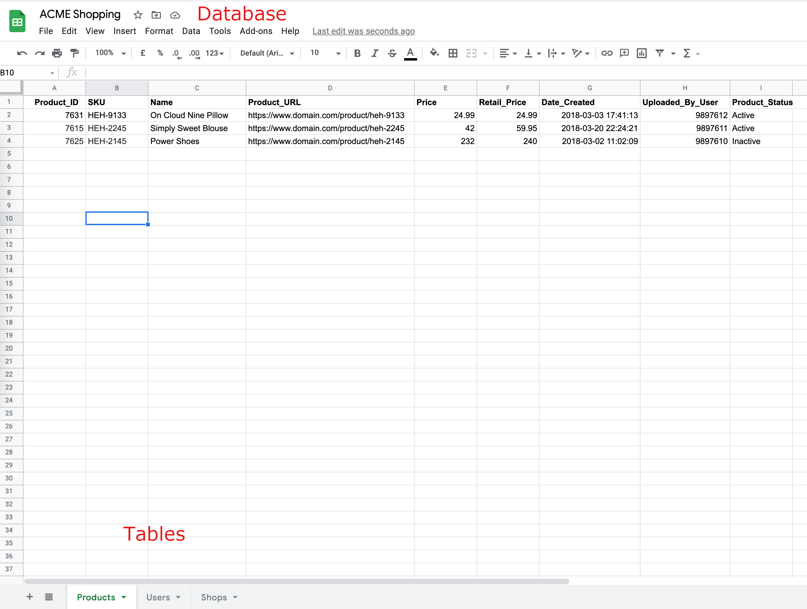
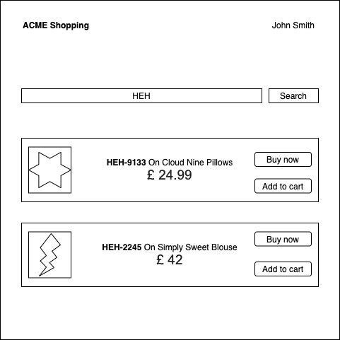

# Web API workshop

The aim of this project is to get a basic understanding of what web apis are and
how modern applications(web apps and mobile apps) use them.

## Websites, Web apps and Web APIs

- A web site or a web app is usually server software that **displays**
or **operates on** data stored **somewhere**.
- If the site data is stored on a database, we tend to call the site a webapp.
Otherwise, its a website if its just static data.
- There is little to no differentiation between websites and webapps nowadays, as
most sites get their data from a database somewhere. So its common to see the terms
being used interchangeably.
- Early dynamic websites(think pre-2005 amazon.uk) used to get data from a database
and generate HTML with that data embeded into it. ex: wordpress sites.
- With the mobile revolution, mobile-apps also needed to get the same data. Hence,
sites began decoupling data from the site.
- Another thing that triggered this move was the need for sites to share data. Think
of getting public twitter feeds from many users and displaying on a page somewhere.
- The idea was to make software that **takes data from databases** and **represent it** in
a way that can be **consumed by other applications**.
- The most commonly used representations are
[XML](https://en.wikipedia.org/wiki/XM)([SOAP](https://en.wikipedia.org/wiki/SOAP))
and [JSON](https://en.wikipedia.org/wiki/JSON)([REST](https://en.wikipedia.org/wiki/Representational_state_transfer)). REST/JSON is what we use in PHRs.
- An API is simply an intermediary/common ground between 2 pieces of software. In the case of
webapps, the **representation of data is exactly that** and its understood by both the
client software(web browser/mobile app) and server software.

## Databases

A DBMS in our case is a software that organises and operates on a collection of data.
- A `table` is a collection of similar data.
- A `database` is a collection of tables.

When we make webapps, we create a database that our app will be using. Based on the type
of data, we make tables. For example, if our app name is **ACME Shopping**, we'd have a
database most likely named `acme_database` and it'll have tables like `users`, `products`,
`purchases`, `invoices` and so on.

An analogy of this would be a spreadsheet file. The `entire file` can be compared
to a `database` and the `individual sheets` in the file can be compared to `tables`.

<div align="center">
  
</div>

## Reading web apis?

Let's imagine we are building ACME Shopping, a site to rival amazon.uk.
All it does is when a user searches for a product, it returns back a list of available
products. How a product is represented is where JSON and XML comes in.

<div align="center">
  
</div>

We'll use the following [example structure](https://searchspring.zendesk.com/hc/en-us/articles/201185089-Sample-XML-Data-Feed)
to understand how product data is represented in both XML and
JSON formats for our imaginary shopping site.

### 1. XML

```xml
<?xml version="1.0" encoding="UTF-8"?>
<Products>
  <Product>
    <Product_ID>7631</Product_ID>
    <SKU>HEH-9133</SKU>
    <Name>On Cloud Nine Pillow</Name>
    <Product_URL>https://www.domain.com/product/heh-9133</Product_URL>
    <Price>24.99</Price>
    <Retail_Price>24.99</Retail_Price>
    <Date_Created>2018-03-03 17:41:13</Date_Created>
  </Product>
  <Product>
    <Product_ID>7615</Product_ID>
    <SKU>HEH-2245</SKU>
    <Name>Simply Sweet Blouse</Name>
    <Product_URL>https://www.domain.com/product/heh-2245</Product_URL>
    <Price>42</Price>
    <Retail_Price>59.95</Retail_Price>
    <Date_Created>2018-03-20 22:24:21</Date_Created>
  </Product>
</Products>
```

- e**X**tensible **M**arkup **L**anguage or XML represents information within **tags**.
- In our example, things between `<Products>` and `</Products>` is the entire product list.
- `<Products>` means the start and `</Products>` means the end.
- Things between `<Product>` and `</Product>` gives the info about a product.
- The data between `<Retail_Price>` and `</Retail_Price>` gives the price of that product.

### 2. JSON

```json
{
  "Products": [
    {
      "Product_ID": "7631",
      "SKU": "HEH-9133",
      "Name": "On Cloud Nine Pillow",
      "Product_URL": "https://www.domain.com/product/heh-9133",
      "Price": "24.99",
      "Retail_Price": "24.99",
      "Date_Created": "2018-03-03 17:41:13"
    },
    {
      "Product_ID": "7615",
      "SKU": "HEH-2245",
      "Name": "Simply Sweet Blouse",
      "Product_URL": "https://www.domain.com/product/heh-2245",
      "Price": "42",
      "Retail_Price": "59.95",
      "Date_Created": "2018-03-20 22:24:21"
    }
  ]
}
```

- **J**ava**S**cript **O**bject **N**otation represents information as **key-value** pairs.
- Things within a `{}` represent a single entity (an object).
- Things within a `[]` represent multiple values.
- At a quick glance JSON has less cruft compared to XML

The reader might have noticed that things like `Date_Created`, `Retail_Price`,
`Product_ID` have not made it into the UI from the JSON and XML. These are used
by the application for operating on the individual item. **For example:** `Product_ID`
is commonly used to target each unique item. `Date_Created` can be used for sorting or for
implementing a business logic where items created after a specific date needs to
have a `NEW` banner.


### Understanding the info in a json object

```json
{
  "has_cod": true,
  "min_delivery_date": "2021-04-27T07:31:12.763Z",
  "orders_from": null,
  "sales": 32
}
```

- `has_cod`, `min_delivery_date`, `orders_from`, `sales` are called **keys**.
- `true`, `2021-04-27T07:31:12.763Z`, `null`, `32` are **values**.
- Hence a JSON object is a grouping of **key-value** pairs.
- `has_cod` could mean the item has provision for Cash on Delivery. The value of
`true` for it means that it does. Most APIs come with documentation that one
can refer to get meaning behind keys.
- `2021-04-27T07:31:12.763Z` is a date string with a timezone value attached. To
see its human readable format, open your browser's JavaScript Console. To do this
`Right-click > Inspect element > Console`.
- Paste `new Date('2021-04-27T07:31:12.763Z')`
- `null` means the value is not present.

### Understanding the info in an xml object

```xml
<?xml version="1.0" encoding="UTF-8"?>
<product>
  <has_cod>true</has_cod>
  <min_delivery_date>2021-04-27T07:31:12.763Z</min_delivery_date>
  <orders_from></orders_from>
  <sales>32</sales>
</product>
```

- `has_cod`, `min_delivery_date`, `orders_from`, `sales` are called **tags**.
- values are contained within tags.

## Free and open APIs

- [https://github.com/public-apis/public-apis](https://github.com/public-apis/public-apis)
- [https://public-apis.xyz](https://public-apis.xyz)

## Tools

- [Postman](https://www.postman.com/product/api-client/)
- [SoapUI](https://www.soapui.org/downloads/soapui/)

## Running sample code

- Open terminal
- Install nodejs with
```
$ curl -o- https://raw.githubusercontent.com/nvm-sh/nvm/v0.38.0/install.sh | bash
$ nvm install node
```
- Or download from [https://nodejs.org/en/download/](https://nodejs.org/en/download/)
- In one terminal, go into `api-server`, run `npm i` and then run `npm start`
- In another terminal, go into `web-client`, run `./start.sh`
- The api server is live on [http://localhost:3333](http://localhost:3333).
- The web client is live on [http://localhost:3334](http://localhost:3334).